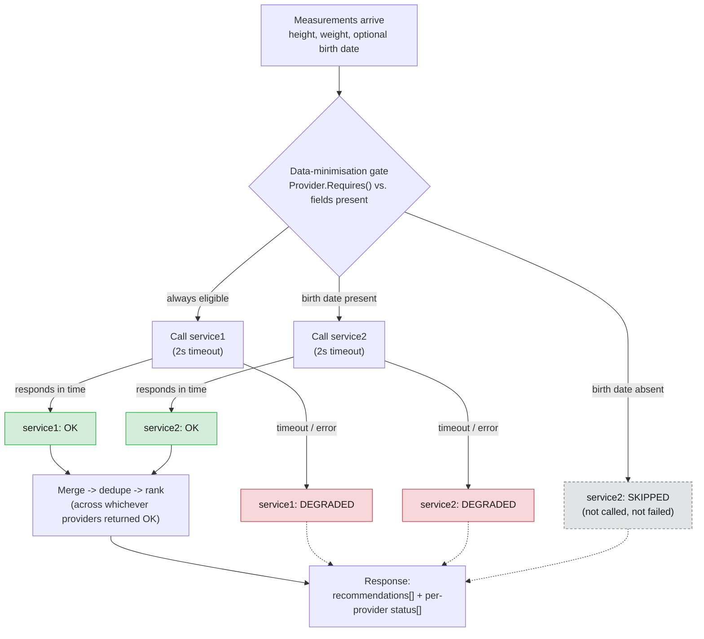
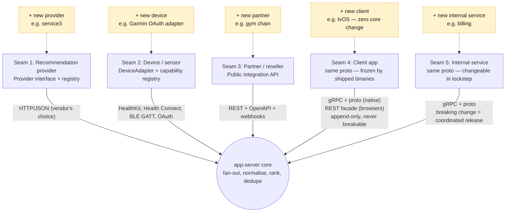
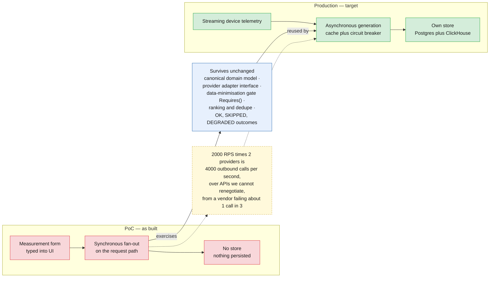

# FunWithActivity — Architecture Diagrams

Five diagrams, each answering one question the deck asks and does not yet show a
picture of: what talks to what, what happens during one recommendation call, where
the system is designed to grow, what the target production architecture looks like,
and what changes to get there from the PoC. Kept deliberately small — a diagram
nobody can read from the back of the room is worse than no diagram.

The first three depict the PoC as built. The last two depict the target production
architecture the customer is actually evaluating — the PoC proves the recommendation
logic; it does not depict how that logic gets triggered at production scale.

---

## 1. System topology

The single most misunderstood thing about this system: **mobile never touches
`web-proxy`.** Browsers go through the REST façade; iOS and Android go straight
to the nginx edge over gRPC and never see `web-proxy` at all. The nginx edge
exists for one reason — DigitalOcean App Platform's ingress proxies HTTP/1.1 to
containers, and the Go gRPC server speaks h2c only, so native clients need a
tier that can terminate TLS and forward gRPC natively (`grpc_pass`). Browsers
never hit that limitation because they're not speaking gRPC in the first place.

In production, any load balancer with native gRPC support replaces the nginx edge
— every major cloud offers one. The workaround is specific to this one PaaS, not
to the architecture, and not to any cloud choice.

---

## 2. Request flow for one recommendation call

The three provider outcomes — **OK**, **SKIPPED**, **DEGRADED** — are deliberately
distinct states, not points on one failure scale, because conflating skipped
with failed is the single most defect-prone thing in this codebase. A provider
is **skipped** when the data-minimisation gate never calls it at all (no birth
date ⇒ `service2` is skipped — GDPR data minimisation, not an error). A provider
is **degraded** when it *was* called and then timed out or errored. Either way,
the response still renders: partial results survive a provider failure, and the
per-request status list tells the client which is which.

Green = **OK** (results contributed to ranking). Grey/dashed = **SKIPPED**
(never called, no failure to report). Red = **DEGRADED** (called, failed or
timed out, no results but not fatal to the request).

---

## 3. The five extension seams

This is the direct answer to the customer's first stated requirement —
*"extensible architecture design."* Extensibility here is not one seam, it's
five, and the organising rule is: **gRPC is the boundary for things we control
on both ends; adapters and REST are the boundary for things we don't.** Each
seam below is a place a new provider, device, partner, client, or internal
service plugs in without changing the core.

The brief names only seams 1 (providers) and 2 (devices) explicitly. Seam 3
(resellers/gyms) is directly implied by the "expanding aggressively" language.
Seams 4 and 5 are the ones a generic vendor deck tends to miss entirely.

**Seams 4 and 5 share a mechanism and differ on a constraint.** A tvOS client
would generate from `recommendations.proto` exactly as iOS does — same service,
same methods, no server change at all. That is the seam working, not a gap in
it. What separates the two is not transport but **who can break whom**. Seam 4
faces binaries we no longer control once they ship: an iOS build from six months
ago is still calling us and cannot be recalled, so that contract is append-only
forever — enforced here by `Fields` slot discipline and by holding the wire
byte-identical across 1.1.0 and 1.2.0 so existing mobile binaries keep working.
Seam 5 faces services we deploy ourselves, where a breaking proto change is a
coordinated release rather than a field incident. Same file, two different
freedoms. Browsers are the one place seam 4 also differs mechanically: they get
the REST facade, because gRPC-web would buy nothing over it here.

---

## 4. Target production architecture

Everything above is the PoC: a form, a synchronous fan-out, no store. This is the
system as it should be built. Device telemetry arrives continuously through a
streaming ingest layer rather than being typed into a form — heart rate at up to
1 Hz dwarfs every other signal the platform receives. Recommendation generation
runs as a background refresh, decoupled from the read path, calling provider
adapters behind a cache and a circuit breaker. The read path serves 2000 RPS peak
entirely from our own store and never calls a vendor inline. State — profile,
entitlements, stored recommendations — lives in Postgres, because it is small,
mutable and transactional. Events live in ClickHouse, because telemetry is
enormous, immutable and analytical.

**There are two ClickHouse deployments, and the reason is access, not volume.**
CH #1 holds health telemetry and population insights and sits in the PHI plane;
CH #2 holds pseudonymous product events — screens, funnels, tier conversion — and
sits in the analytics plane. CH #2 needs a wide audience: analysts, PMs, growth,
BI, dozens of people and services over time. CH #1 needs almost none. Access that
broad next to data that sensitive is where grants drift, and this customer has
already settled a suit over user data. Separating the planes is what makes
"analysts can self-serve" and "health data is tightly held" both true at once. Provider adapters are the
permanent seam, not a placeholder for a future standard API, because the customer
has confirmed no control over third-party interfaces. Entitlement / subscription
sits on the read path itself, because paid tiers make provider selection depend on
what a user pays for as well as what data they supplied. And the data-minimisation
gate — `Provider.Requires()` versus fields present — survives from the PoC
completely unchanged; only its trigger moves, from an inline call to a background
one.

Blue fill = the two stores, split by the nature of the data they hold, not by a
size threshold. Purple outline = the asynchronous, provider-facing side — nothing
here runs on a request. Green outline = the read path — nothing here calls a
vendor.

**Two boxes are drawn inside a process, not beside it.** The
data-minimisation gate is `Provider.Requires()` — a function call in the refresh
worker, the same one running in the PoC today. The entitlement check is a
Postgres read on the way through `app-server`. Neither is a service, and drawing
either as its own box would put a network hop, a deployment and a failure mode on
the diagram that do not exist in the design. They are shown because they are the
two decisions that make this architecture defensible, not because they are
tiers — so they sit inside the process that owns them. If entitlement ever moves
out, it will be because billing gets its own team and cadence, not because the
read path needs it remote.

**There are two vendor seams, and they point in opposite directions.** Inbound
connectors pull user data *in* from third-party health APIs — an OAuth-linked
account, a webhook, a nightly backfill — and normalise it into the same schema a
device sample uses, so everything downstream of the buffer is source-agnostic.
Outbound provider adapters call recommendation services and are the seam already
built in the PoC. Conflating them would be a mistake: one is a data source
subject to the same PHI handling as a wearable, the other is a compute
dependency we send the minimum to.

**No client writes to a store.** Browser events reach CH #2 through
`web-proxy`, native events through `app-server` — the same two doors the read
path already uses. The reason is not tidiness: pseudonymisation has to happen
somewhere we control. The `analytics_id` is assigned server-side, at the one
point where the real user id is known and can be stripped; a client that
assigned its own would make the analytics plane's whole guarantee
unverifiable. Routing events through the existing tiers also means they inherit
auth, validation and rate limiting rather than needing their own.

**So ClickHouse #1 is not the gate's only input.** Measured fields arrive through
the stream; declared fields do not — a date of birth is never on a wearable
feed, so it comes from the Postgres profile the user filled in, alongside their
entitlement. The gate compares whatever is present, from either source, against
what each provider requires. That is also why the projection out of CH #1 is
narrow: the recommendation pipeline sees current values, never raw samples.

---

## 4a. How we address HIPAA and GDPR

For each requirement that binds this product: the mechanism, and where it
sits. Split into what is load-bearing today, what is designed but not drawn,
and what no architecture can discharge.

### Already load-bearing, and visible on the diagram

| Requirement | How we address it | Where |
|---|---|---|
| **GDPR Art. 5(1)(c)** — collect and share only what is necessary | A provider declares the fields it needs; the aggregator **skips** one whose fields are absent rather than calling it with placeholder data | `Provider.Requires()`, in the refresh worker |
| **Art. 32 / HIPAA §164.312(a)** — access control proportionate to sensitivity | Two stores in separate accounts, so the wide-audience one physically cannot hold health values and a broad grant cannot drift onto PHI | ClickHouse #1 vs #2 |
| **Art. 4(5)** — pseudonymisation | `analytics_id` is assigned server-side, at the one point where the real user id is known and can be stripped; a client cannot be trusted with this | `web-proxy` and `app-server`, on the way to CH #2 |
| **§164.312(b)** — audit controls | No client writes to a store; every write passes a tier we operate, so auth, validation and audit have exactly two chokepoints | The two read-path tiers |
| **Art. 28 / §164.308(b)** — limiting disclosure to processors | Vendors are never called on the read path, so no PHI leaves the boundary as a side effect of someone opening the app | `Entitlement → Postgres → API` |

### Designed, not yet drawn

Each adds a box to a diagram already at its density limit.

- **Per-region cells** — own Postgres, own ClickHouse, own boundary, users
  pinned home. One decision covering Art. 44 residency, the phased rollout and
  blast-radius containment.
- **KMS and per-user keys** — the erasure mechanism. Row deletion is the wrong
  tool: `MergeTree` parts are immutable, so deleting one user rewrites nearly
  every part, while key destruction also reaches backups and replicas and
  leaves an auditable event. What is shredded is the identity linkage, not the
  samples — encrypting samples per user would collapse columnar compression
  and make population queries impossible. Whether the orphaned rows are then
  anonymous under Art. 4(5) is a DPO determination, not ours.
- **Consent and PHI-access audit log** — append-only, six-year retention,
  which conflicts with Art. 17. Where erasure yields to retention is the
  customer's call.

### Identity and sessions

Decided, because every other control keys off a user id.

**Accounts:** the region's Cognito user pool. It owns credentials, MFA,
lockout, reset and sign-in audit; we never store a password. Cloud-native
rather than Auth0 so identity does not add a company to the Art. 28 chain —
it is inside the BAA already signed. On Azure the equivalent is Entra
External ID.

**Sessions:** ours, not the IdP's. OIDC runs once at login; `app-server` then
mints an **opaque** session token.

| Client | Carries it as | Stored in |
|---|---|---|
| Web | httpOnly, Secure, `SameSite=Lax` cookie, set by `web-proxy` | Nothing in browser JS |
| iOS / Android | gRPC metadata, as the internal token already is | Keychain / Android Keystore |

**Every request looks the session up**, so revocation is immediate:
withdrawal of consent, erasure, a lost device and staff offboarding all take
effect on the next call. That costs one indexed read on a path that already
queries Postgres for the entitlement check — not a new dependency.

Two consequences worth stating:

- **Do not cache the lookup.** A 30-second cache silently reinstates the
  revocation window it was chosen to remove.
- **Sessions are per-cell**, like the rest of a user's data, and the session
  store inherits Postgres's availability target.

Not a self-contained JWT: it cannot be revoked before it expires, and the
usual mitigation — short TTL plus a revocable refresh token — reintroduces
the server state that was the reason to avoid it, while still leaving a
window. Refresh tokens remain useful for staying signed in; the credential
presented on each call is separate from that.

### The standard challenges, and where we stand

The twelve challenges any health aggregator faces, answered for this system.
Three are gaps; the status column says which.

| # | Challenge | Our answer | Status |
|---|---|---|---|
| 1 | Consent (Art. 9) | Per-purpose, revocable, before any HealthKit/Health Connect read, keyed to the session's user id. Today iOS relies on the OS prompt, which is not consent | **Gap** |
| 2 | Erasure | Crypto-shred the identity linkage, not the samples — encrypting samples would break compression and cross-user queries | Designed |
| 3 | Portability | Export endpoint over Postgres state plus the pseudonym's ClickHouse rows | **Gap** |
| 4 | Device storage | Nothing persisted on any client, so nothing reaches OS backups | Built |
| 5 | Platform health-API rules | OS store stays primary; iOS reads height/weight/DOB only, Android's read is cut | Built |
| 6 | Web at rest | No PHI in the browser. Missing: `Cache-Control: no-store`, and there is no session yet | Partial |
| 7 | Audit trail | Append-only PHI-access log, six-year retention — the one that conflicts with Art. 17 | Designed |
| 8 | Vendor chain / BAAs | No analytics, crash or push SDK ships; no measurement value is logged. BAA is a contract, not a control | Built |
| 9 | Residency | Per-region cells, users pinned home | Designed |
| 10 | Breach readiness | DPIA named as mandatory. Detection and incident process not built | **Gap** |
| 11 | Sessions & access | Cognito accounts, our own opaque session, revoked server-side on every request (above) | Designed |
| 12 | Applicability | Covered entity vs FTC HBNR is unanswered; we build to HIPAA either way | Open |

Rows 4, 5, 6 and 8 were verified in the code, not asserted: no
`localStorage`/IndexedDB, no `SharedPreferences`/Room/SQLite, iOS
`NSUserDefaults` only inside `#if DEBUG`, and dependency lists containing
only gRPC, Protobuf and platform UI.

### Not addressable by architecture at all

BAAs with the cloud provider and every vendor touching PHI; the DPIA Art. 35
requires for profiling at scale; breach-notification runbooks (§164.400,
Art. 33/34); retention schedules; access review. A diagram shows where
controls attach, not that anyone signed anything.

Row 12 is the one that changes the others: covered-entity status decides
retention and BAA obligations. The architecture is built so that answer
changes configuration and contracts, not topology.

---

## 5. What changes from PoC to production

This is the honest centrepiece, not a list of shortcomings. At 2000 RPS peak, two
providers is 4,000 outbound third-party calls per second, over APIs the customer
has confirmed it cannot renegotiate, from a vendor already measured failing roughly
one call in three. The PoC's synchronous, per-request fan-out cannot survive that
arithmetic, so production moves the vendor call off the request path entirely:
telemetry streams in continuously, generation happens asynchronously with caching
and a circuit breaker, and the read path serves from a store that now has to exist.
None of that invalidates the PoC's logic. The canonical domain model, the provider
adapter interface, the data-minimisation gate, ranking and dedupe, and the three
provider outcomes (OK / SKIPPED / DEGRADED) carry over unchanged — only what calls
them changes, from a synchronous fan-out on the request path to an asynchronous
background refresh.

That phrase is the hinge of the whole argument, so it is worth spelling out.
**Synchronous fan-out on the request path** means that while a user's request is
still open, `app-server` calls every eligible provider in parallel and blocks
until they answer or time out. The user's latency *is* the slowest vendor's
latency. Four consequences compound at peak: **amplification** — one read
becomes two vendor calls, so vendor rate limits are hit by user traffic spikes
with nothing to smooth them; **latency coupling** — our p99 is their p99, and
theirs is over two seconds cold against a 60–120 ms warm call; **failure
coupling** — a vendor failing about one call in three degrades roughly a third
of requests every time, because with no store there is nothing to fall back on,
making our availability the product of theirs; and **concurrency** — by Little's
Law, 2000 RPS at roughly a second of service time is about 2,000 in-flight
fan-outs holding some 4,000 outbound sockets, all of them waiting.

**Asynchronous background refresh** breaks each of those. Recommendations are
computed on a schedule and written to Postgres, so a read is a point lookup that
never touches a vendor. The decisive change is that vendor call volume stops
being a function of read volume and becomes a function of *active users ×
refresh cadence*: roughly 70 calls per second for three million users refreshed
daily, against 4,000 per second at peak — about a fifty-fold reduction, and
still an order of magnitude even at four refreshes a day. A vendor outage stops
being a user-visible failure and becomes stale-but-served data, with staleness
as an explicit budget rather than an accident.

Red = PoC scaffolding, built to prove the logic and nothing more. Green = the
production replacement each red box maps to. Blue = the logic itself, which the
PoC exercises synchronously today and production will call asynchronously
tomorrow — same code path, different trigger. The form, the synchronous fan-out
and the absent store were never a design position; they are exactly what the
brief's own simplification — "for POC purposes, all required data could be asked
in application UI" — produces, and they are what disappear first.
