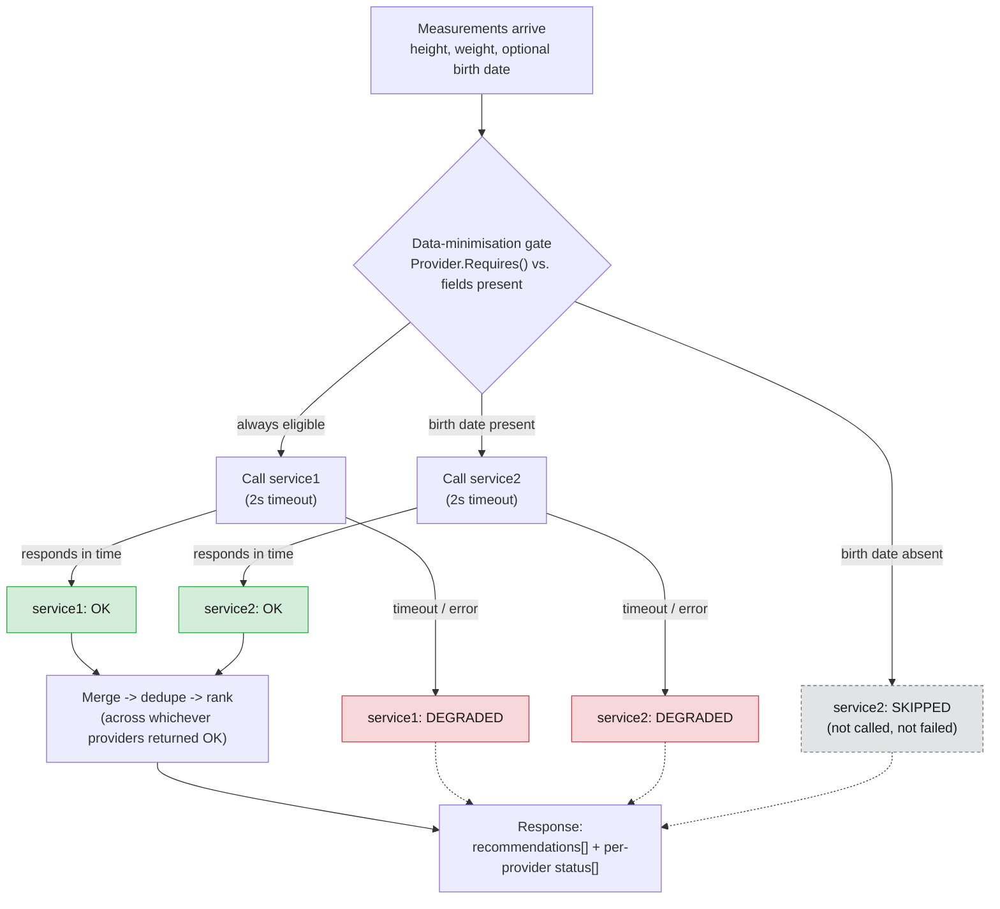
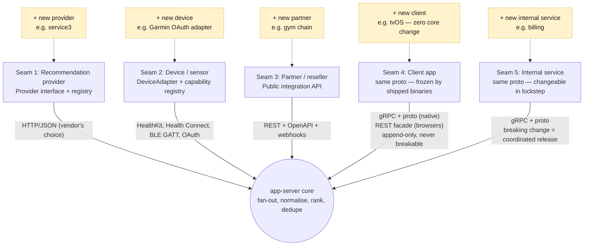
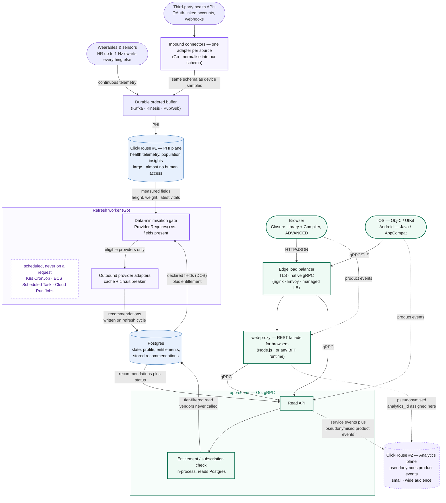
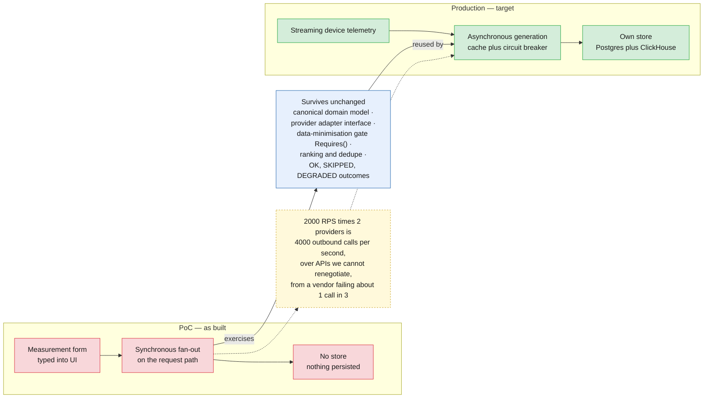

# FunWithActivity — Architecture Diagrams

Five diagrams, each answering one question the deck asks and does not yet show a
picture of: what talks to what, what happens during one recommendation call, where
the system is designed to grow, what the target production architecture looks like,
and what changes to get there from the PoC. Kept deliberately small — a diagram
nobody can read from the back of the room is worse than no diagram.

The first three depict the PoC as built. The last two depict the target production
architecture the customer is actually evaluating — the PoC proves the recommendation
logic; it does not depict how that logic gets triggered at production scale.

---

## 1. System topology

The single most misunderstood thing about this system: **mobile never touches
`web-proxy`.** Browsers go through the REST façade; iOS and Android go straight
to the nginx edge over gRPC and never see `web-proxy` at all. The nginx edge
exists for one reason — DigitalOcean App Platform's ingress proxies HTTP/1.1 to
containers, and the Go gRPC server speaks h2c only, so native clients need a
tier that can terminate TLS and forward gRPC natively (`grpc_pass`). Browsers
never hit that limitation because they're not speaking gRPC in the first place.

In production, any load balancer with native gRPC support replaces the nginx edge
— every major cloud offers one. The workaround is specific to this one PaaS, not
to the architecture, and not to any cloud choice.

---

## 2. Request flow for one recommendation call

The three provider outcomes — **OK**, **SKIPPED**, **DEGRADED** — are deliberately
distinct states, not points on one failure scale, because conflating skipped
with failed is the single most defect-prone thing in this codebase. A provider
is **skipped** when the data-minimisation gate never calls it at all (no birth
date ⇒ `service2` is skipped — GDPR data minimisation, not an error). A provider
is **degraded** when it *was* called and then timed out or errored. Either way,
the response still renders: partial results survive a provider failure, and the
per-request status list tells the client which is which.

Green = **OK** (results contributed to ranking). Grey/dashed = **SKIPPED**
(never called, no failure to report). Red = **DEGRADED** (called, failed or
timed out, no results but not fatal to the request).

---

## 3. The five extension seams

This is the direct answer to the customer's first stated requirement —
*"extensible architecture design."* Extensibility here is not one seam, it's
five, and the organising rule is: **gRPC is the boundary for things we control
on both ends; adapters and REST are the boundary for things we don't.** Each
seam below is a place a new provider, device, partner, client, or internal
service plugs in without changing the core.

The brief names only seams 1 (providers) and 2 (devices) explicitly. Seam 3
(resellers/gyms) is directly implied by the "expanding aggressively" language.
Seams 4 and 5 are the ones a generic vendor deck tends to miss entirely.

**Seams 4 and 5 share a mechanism and differ on a constraint.** A tvOS client
would generate from `recommendations.proto` exactly as iOS does — same service,
same methods, no server change at all. That is the seam working, not a gap in
it. What separates the two is not transport but **who can break whom**. Seam 4
faces binaries we no longer control once they ship: an iOS build from six months
ago is still calling us and cannot be recalled, so that contract is append-only
forever — enforced here by `Fields` slot discipline and by holding the wire
byte-identical across 1.1.0 and 1.2.0 so existing mobile binaries keep working.
Seam 5 faces services we deploy ourselves, where a breaking proto change is a
coordinated release rather than a field incident. Same file, two different
freedoms. Browsers are the one place seam 4 also differs mechanically: they get
the REST facade, because gRPC-web would buy nothing over it here.

---

## 4. Target production architecture

Everything above is the PoC: a form, a synchronous fan-out, no store. This is the
system as it should be built. Device telemetry arrives continuously through a
streaming ingest layer rather than being typed into a form — heart rate at up to
1 Hz dwarfs every other signal the platform receives. Recommendation generation
runs as a background refresh, decoupled from the read path, calling provider
adapters behind a cache and a circuit breaker. The read path serves 2000 RPS peak
entirely from our own store and never calls a vendor inline. State — profile,
entitlements, stored recommendations — lives in Postgres, because it is small,
mutable and transactional. Events live in ClickHouse, because telemetry is
enormous, immutable and analytical.

**There are two ClickHouse deployments, and the reason is access, not volume.**
CH #1 holds health telemetry and population insights and sits in the PHI plane;
CH #2 holds pseudonymous product events — screens, funnels, tier conversion — and
sits in the analytics plane. CH #2 needs a wide audience: analysts, PMs, growth,
BI, dozens of people and services over time. CH #1 needs almost none. Access that
broad next to data that sensitive is where grants drift, and this customer has
already settled a suit over user data. Separating the planes is what makes
"analysts can self-serve" and "health data is tightly held" both true at once. Provider adapters are the
permanent seam, not a placeholder for a future standard API, because the customer
has confirmed no control over third-party interfaces. Entitlement / subscription
sits on the read path itself, because paid tiers make provider selection depend on
what a user pays for as well as what data they supplied. And the data-minimisation
gate — `Provider.Requires()` versus fields present — survives from the PoC
completely unchanged; only its trigger moves, from an inline call to a background
one.

Blue fill = the two stores, split by the nature of the data they hold, not by a
size threshold. Purple outline = the asynchronous, provider-facing side — nothing
here runs on a request. Green outline = the read path — nothing here calls a
vendor.

**Two boxes are drawn inside a process, not beside it.** The
data-minimisation gate is `Provider.Requires()` — a function call in the refresh
worker, the same one running in the PoC today. The entitlement check is a
Postgres read on the way through `app-server`. Neither is a service, and drawing
either as its own box would put a network hop, a deployment and a failure mode on
the diagram that do not exist in the design. They are shown because they are the
two decisions that make this architecture defensible, not because they are
tiers — so they sit inside the process that owns them. If entitlement ever moves
out, it will be because billing gets its own team and cadence, not because the
read path needs it remote.

**There are two vendor seams, and they point in opposite directions.** Inbound
connectors pull user data *in* from third-party health APIs — an OAuth-linked
account, a webhook, a nightly backfill — and normalise it into the same schema a
device sample uses, so everything downstream of the buffer is source-agnostic.
Outbound provider adapters call recommendation services and are the seam already
built in the PoC. Conflating them would be a mistake: one is a data source
subject to the same PHI handling as a wearable, the other is a compute
dependency we send the minimum to.

**No client writes to a store.** Browser events reach CH #2 through
`web-proxy`, native events through `app-server` — the same two doors the read
path already uses. The reason is not tidiness: pseudonymisation has to happen
somewhere we control. The `analytics_id` is assigned server-side, at the one
point where the real user id is known and can be stripped; a client that
assigned its own would make the analytics plane's whole guarantee
unverifiable. Routing events through the existing tiers also means they inherit
auth, validation and rate limiting rather than needing their own.

**So ClickHouse #1 is not the gate's only input.** Measured fields arrive through
the stream; declared fields do not — a date of birth is never on a wearable
feed, so it comes from the Postgres profile the user filled in, alongside their
entitlement. The gate compares whatever is present, from either source, against
what each provider requires. That is also why the projection out of CH #1 is
narrow: the recommendation pipeline sees current values, never raw samples.

---

## 4a. How we address HIPAA and GDPR

The twelve challenges any health aggregator faces, each with the position we
would defend. US and EU both in scope, so both regimes bind throughout.

**1. Consent (Art. 9).** Append-only events —
`(user, purpose, policy_version, granted, at)`. Withdrawal is a new row, never
an update, so the table answers *what was agreed, when, under which wording*.
Enforced where a purpose is acted on, **not** in `Provider.Requires()`: that
gate means "field absent", and adding "or not permitted" would collapse two
different reasons into one `skipped` status three clients already read
specifically. HealthKit prefill moves behind recorded consent — the OS prompt
is Apple's permission to read the store, not an Art. 9 legal basis. No
third-party SDK to gate, because we ship none.

**2. Erasure.** Telemetry lives under a pseudonym in ClickHouse; the
pseudonym→person mapping is encrypted in Postgres with a per-user KMS key.
Erasure destroys the key.

Backups are the reason it is done this way, and the managed-database detail
matters:

- Encryption is **application-level**, so automated snapshots, PITR and any
  `pg_dump` contain ciphertext. Destroying the key makes every one of those
  copies unreadable — which row deletion can never do.
- The managed database's **own** storage encryption does not provide this. One
  CMK for the whole cluster is all-or-nothing: destroying it destroys the
  database, not one user.
- Anything erased by row deletion rather than key destruction needs a deletion
  list re-applied after any restore, inside the documented backup window.
- **No decrypted logical dumps.** A dump of decrypted data is a new PHI
  location with its own retention, and it silently defeats the mechanism.
- Consent and PHI-access logs are exempt: six-year retention, which conflicts
  with Art. 17 by design. Where erasure yields to retention is the customer's
  determination.

**3. Export (Art. 20).** Async job; bundle written to object storage;
short-lived signed URL. Contents: profile, consent history, latest
values, rollups, machine-readable. The bundle is itself PHI — encrypted at
rest, short expiry, access logged.

**4. Device storage at rest.** The PoC persists nothing on any client, so
today there is nothing at rest to protect. For production, offline reading is
worth an encrypted local cache: Room + SQLCipher with a hardware-backed
Keystore key on Android; Core Data with `NSFileProtectionComplete` plus
Keychain on iOS; both excluded from iCloud and Google backups. That accepts
PHI at rest on a device we do not control, plus a key lifecycle per platform —
the price of the app working without a connection.

**5. Platform health-API rules.** The OS store stays the system of record; we
read on demand. Server-side retention is tiered: raw samples on a short
partition TTL, rollups and latest values retained. That bounds raw PHI at any
moment and uses the one deletion ClickHouse is good at — `DROP PARTITION` is
metadata-only. The TTL needs a stated reason, which Art. 5(1)(e) requires
anyway.

**6. Web at rest.** No PHI in the browser — no `localStorage`, no IndexedDB,
true today and verified. Plus `Cache-Control: no-store` on health responses
and an httpOnly session cookie. The mobile-rich / web-thin asymmetry is stated
rather than hidden.

**7. Audit trail.** `phi_access_log`, append-only, monthly partitions, beside
`consent_events` in the home cell's Postgres. One store, one retention rule,
expiry by partition drop. Writes sit on the read path, so it must stay cheap.

**8. Vendor chain / BAAs.** No analytics, crash-reporting or push SDK ships on
any client — verified, not asserted. No measurement value reaches a log line;
only a propagated `request_id`. BAA with the cloud provider, and Cognito sits
inside it, so identity adds no company to the Art. 28 chain.

**9. Residency.** Holding to both regimes everywhere is a *compliance
posture*; residency is a separate, *transfer* question, and the second does
not follow from the first. Art. 44+ restricts moving EU personal data to US
infrastructure however well we comply elsewhere.

GDPR does not require localisation — transfers are lawful today under the
EU–US Data Privacy Framework. But that is the third such decision after Safe
Harbour and Privacy Shield were struck down, and the SCC fallback for Art. 9
data is an argument that has to keep being won.

**Plan A — one EU region, both markets.** EU data never leaves; US users take
the latency, which costs nothing on these paths. Half the infrastructure, and
no routing to build.

**Plan B — a cell per region.** Two of everything, plus the one part that
cannot be regional: a **global directory**, keyed hash → home region. A
returning user on a new device must be routed *before* they authenticate.
Keyed because emails are low-entropy and a plain hash is reversible. Home
region from self-declared country; changing it is a consented, logged
migration.

Either plan, residency covers backups, logs, metrics, export bundles and
sub-processors — not just the database. Pinning Postgres while shipping logs
to a US vendor reintroduces the transfer, which is what makes (8) load-bearing.

**10. Breach readiness.** The audit log is the detection surface: alert on
access-rate spikes, bulk reads and cross-cell access. Written incident runbook
with the 72h clock and named roles. DPIA performed — mandatory here, since
this is profiling at scale.

**11. Sessions & access.** Cognito accounts per region; we never store a
credential. OIDC once at login, then our own **opaque** session token looked
up server-side on every request — so revocation is immediate for withdrawal,
erasure, a lost device or offboarding. Affordable because the read path
already queries Postgres. Idle timeout; biometric re-auth before PHI views on
mobile. RBAC when staff-facing access exists — none today. *Never cache the
session lookup: a 30-second cache restores the window it removed.*

**12. Applicability.** Unanswered, and it is a question for the customer:
covered entity or business associate, versus consumer wellness under FTC HBNR
plus Art. 9. We build to HIPAA safeguards regardless — nothing is wasted if
the answer is wellness, and the B2B/provider path stays open without
re-architecture.

**Cross-cutting.** Data is a liability with a lifecycle, not an asset to
accumulate: know where every piece lives — device, server, analytics, logs,
backups — why it is held, and be able to delete or produce it on demand.
`Provider.Requires()` is that principle at its smallest scale, and it is
already running.

## 5. What changes from PoC to production

This is the honest centrepiece, not a list of shortcomings. At 2000 RPS peak, two
providers is 4,000 outbound third-party calls per second, over APIs the customer
has confirmed it cannot renegotiate, from a vendor already measured failing roughly
one call in three. The PoC's synchronous, per-request fan-out cannot survive that
arithmetic, so production moves the vendor call off the request path entirely:
telemetry streams in continuously, generation happens asynchronously with caching
and a circuit breaker, and the read path serves from a store that now has to exist.
None of that invalidates the PoC's logic. The canonical domain model, the provider
adapter interface, the data-minimisation gate, ranking and dedupe, and the three
provider outcomes (OK / SKIPPED / DEGRADED) carry over unchanged — only what calls
them changes, from a synchronous fan-out on the request path to an asynchronous
background refresh.

That phrase is the hinge of the whole argument, so it is worth spelling out.
**Synchronous fan-out on the request path** means that while a user's request is
still open, `app-server` calls every eligible provider in parallel and blocks
until they answer or time out. The user's latency *is* the slowest vendor's
latency. Four consequences compound at peak: **amplification** — one read
becomes two vendor calls, so vendor rate limits are hit by user traffic spikes
with nothing to smooth them; **latency coupling** — our p99 is their p99, and
theirs is over two seconds cold against a 60–120 ms warm call; **failure
coupling** — a vendor failing about one call in three degrades roughly a third
of requests every time, because with no store there is nothing to fall back on,
making our availability the product of theirs; and **concurrency** — by Little's
Law, 2000 RPS at roughly a second of service time is about 2,000 in-flight
fan-outs holding some 4,000 outbound sockets, all of them waiting.

**Asynchronous background refresh** breaks each of those. Recommendations are
computed on a schedule and written to Postgres, so a read is a point lookup that
never touches a vendor. The decisive change is that vendor call volume stops
being a function of read volume and becomes a function of *active users ×
refresh cadence*: roughly 70 calls per second for three million users refreshed
daily, against 4,000 per second at peak — about a fifty-fold reduction, and
still an order of magnitude even at four refreshes a day. A vendor outage stops
being a user-visible failure and becomes stale-but-served data, with staleness
as an explicit budget rather than an accident.

Red = PoC scaffolding, built to prove the logic and nothing more. Green = the
production replacement each red box maps to. Blue = the logic itself, which the
PoC exercises synchronously today and production will call asynchronously
tomorrow — same code path, different trigger. The form, the synchronous fan-out
and the absent store were never a design position; they are exactly what the
brief's own simplification — "for POC purposes, all required data could be asked
in application UI" — produces, and they are what disappear first.
