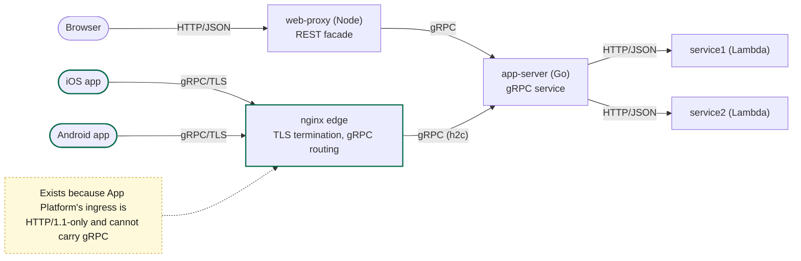
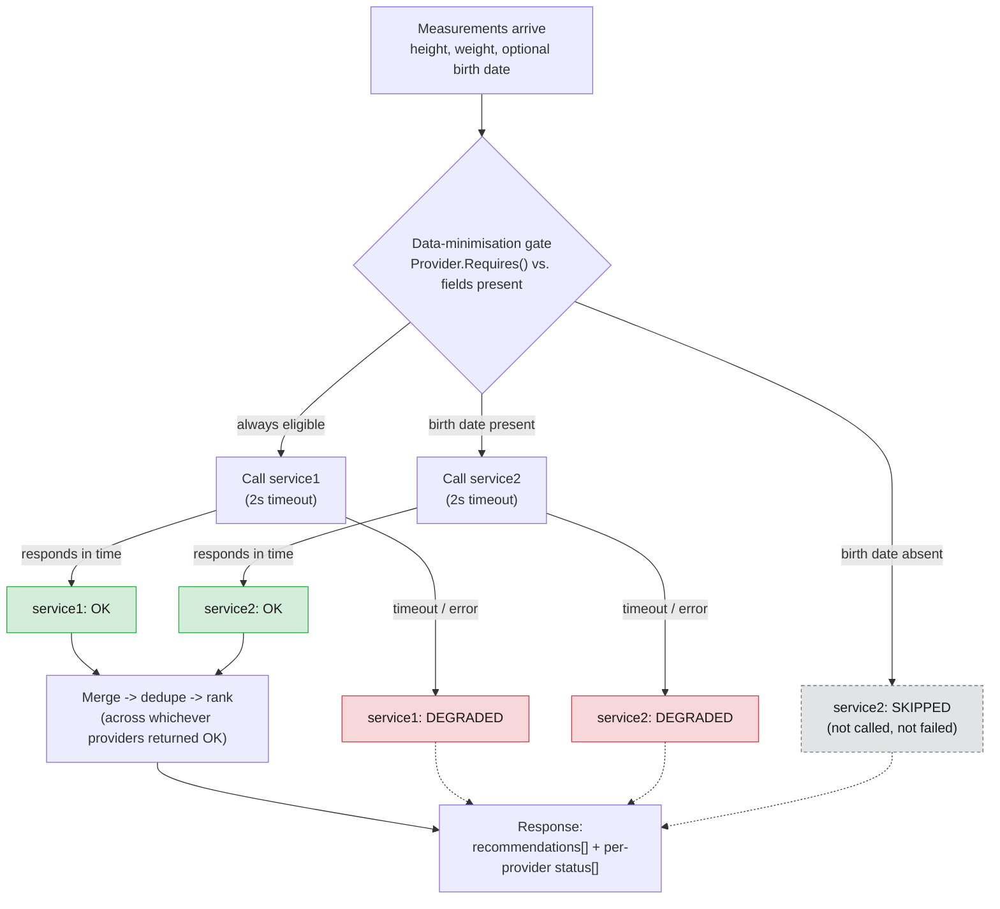
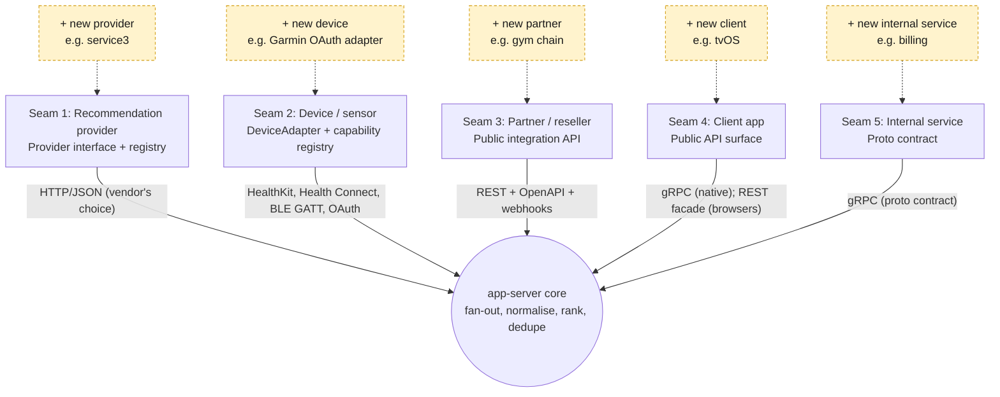
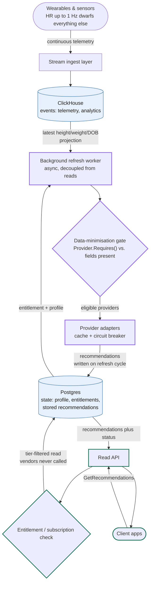
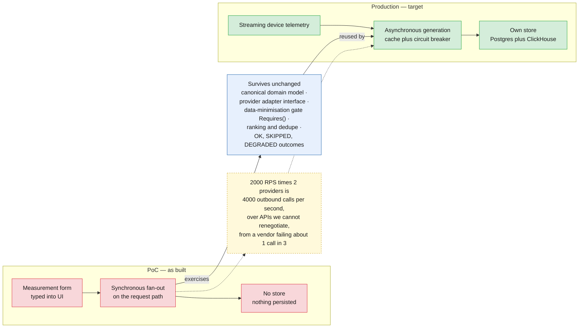

# FunWithActivity — Architecture Diagrams

Five diagrams, each answering one question the deck asks and does not yet show a
picture of: what talks to what, what happens during one recommendation call, where
the system is designed to grow, what the target production architecture looks like,
and what changes to get there from the PoC. Kept deliberately small — a diagram
nobody can read from the back of the room is worse than no diagram.

The first three depict the PoC as built. The last two depict the target production
architecture the customer is actually evaluating — the PoC proves the recommendation
logic; it does not depict how that logic gets triggered at production scale.

---

## 1. System topology

The single most misunderstood thing about this system: **mobile never touches
`web-proxy`.** Browsers go through the REST façade; iOS and Android go straight
to the nginx edge over gRPC and never see `web-proxy` at all. The nginx edge
exists for one reason — DigitalOcean App Platform's ingress proxies HTTP/1.1 to
containers, and the Go gRPC server speaks h2c only, so native clients need a
tier that can terminate TLS and forward gRPC natively (`grpc_pass`). Browsers
never hit that limitation because they're not speaking gRPC in the first place.

In production (AWS), an ALB with a gRPC target group replaces the nginx edge —
the workaround is specific to this one PaaS, not to the architecture.

---

## 2. Request flow for one recommendation call

The three provider outcomes — **OK**, **SKIPPED**, **DEGRADED** — are deliberately
distinct states, not points on one failure scale, because conflating skipped
with failed is the single most defect-prone thing in this codebase. A provider
is **skipped** when the data-minimisation gate never calls it at all (no birth
date ⇒ `service2` is skipped — GDPR data minimisation, not an error). A provider
is **degraded** when it *was* called and then timed out or errored. Either way,
the response still renders: partial results survive a provider failure, and the
per-request status list tells the client which is which.

Green = **OK** (results contributed to ranking). Grey/dashed = **SKIPPED**
(never called, no failure to report). Red = **DEGRADED** (called, failed or
timed out, no results but not fatal to the request).

---

## 3. The five extension seams

This is the direct answer to the customer's first stated requirement —
*"extensible architecture design."* Extensibility here is not one seam, it's
five, and the organising rule is: **gRPC is the boundary for things we control
on both ends; adapters and REST are the boundary for things we don't.** Each
seam below is a place a new provider, device, partner, client, or internal
service plugs in without changing the core.

The brief names only seams 1 (providers) and 2 (devices) explicitly. Seam 3
(resellers/gyms) is directly implied by the "expanding aggressively" language.
Seams 4 and 5 are the ones a generic vendor deck tends to miss entirely.

---

## 4. Target production architecture

Everything above is the PoC: a form, a synchronous fan-out, no store. This is the
system as it should be built. Device telemetry arrives continuously through a
streaming ingest layer rather than being typed into a form — heart rate at up to
1 Hz dwarfs every other signal the platform receives. Recommendation generation
runs as a background refresh, decoupled from the read path, calling provider
adapters behind a cache and a circuit breaker. The read path serves 2000 RPS peak
entirely from our own store and never calls a vendor inline. State — profile,
entitlements, stored recommendations — lives in Postgres; events — telemetry,
analytics — live in ClickHouse, because state is small, mutable and transactional
while telemetry is enormous, immutable and analytical. Provider adapters are the
permanent seam, not a placeholder for a future standard API, because the customer
has confirmed no control over third-party interfaces. Entitlement / subscription
sits on the read path itself, because paid tiers make provider selection depend on
what a user pays for as well as what data they supplied. And the data-minimisation
gate — `Provider.Requires()` versus fields present — survives from the PoC
completely unchanged; only its trigger moves, from an inline call to a background
one.

Blue fill = the two stores, split by the nature of the data they hold, not by a
size threshold. Purple outline = the asynchronous, provider-facing side — nothing
here runs on a request. Green outline = the read path — nothing here calls a
vendor. The projection from ClickHouse into the refresh worker is the one narrow
point where the telemetry domain feeds the recommendation domain; the rest of the
recommendation pipeline never sees a raw sample.

---

## 5. What changes from PoC to production

This is the honest centrepiece, not a list of shortcomings. At 2000 RPS peak, two
providers is 4,000 outbound third-party calls per second, over APIs the customer
has confirmed it cannot renegotiate, from a vendor already measured failing roughly
one call in three. The PoC's synchronous, per-request fan-out cannot survive that
arithmetic, so production moves the vendor call off the request path entirely:
telemetry streams in continuously, generation happens asynchronously with caching
and a circuit breaker, and the read path serves from a store that now has to exist.
None of that invalidates the PoC's logic. The canonical domain model, the provider
adapter interface, the data-minimisation gate, ranking and dedupe, and the three
provider outcomes (OK / SKIPPED / DEGRADED) carry over unchanged — only what calls
them changes, from a synchronous fan-out on the request path to an asynchronous
background refresh.

Red = PoC scaffolding, built to prove the logic and nothing more. Green = the
production replacement each red box maps to. Blue = the logic itself, which the
PoC exercises synchronously today and production will call asynchronously
tomorrow — same code path, different trigger. The form, the synchronous fan-out
and the absent store were never a design position; they are exactly what the
brief's own simplification — "for POC purposes, all required data could be asked
in application UI" — produces, and they are what disappear first.
