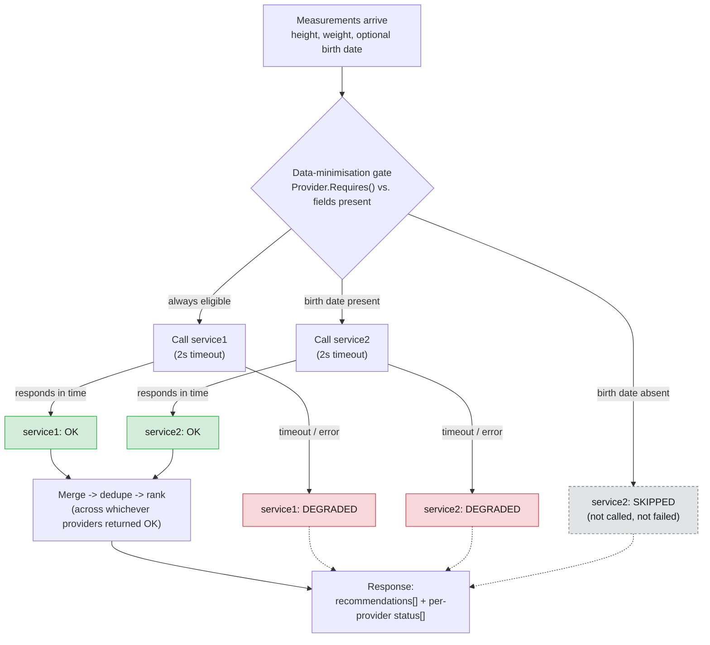
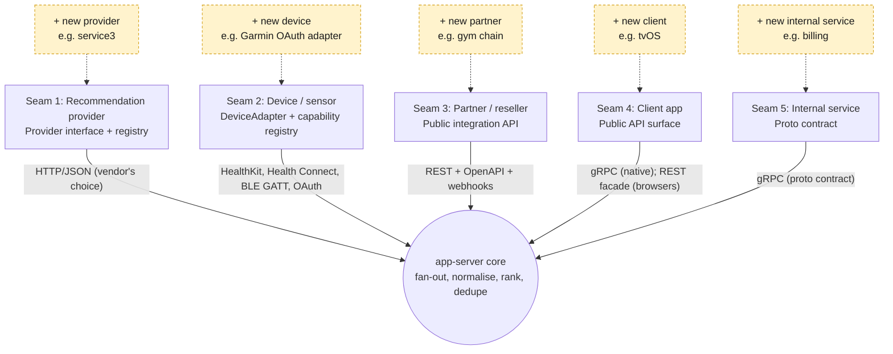

# FunWithActivity — Architecture Diagrams

Three diagrams, each answering one question the deck asks and does not yet show a
picture of: what talks to what, what happens during one recommendation call, and
where the system is designed to grow. Kept deliberately small — a diagram nobody
can read from the back of the room is worse than no diagram.

---

## 1. System topology

The single most misunderstood thing about this system: **mobile never touches
`web-proxy`.** Browsers go through the REST façade; iOS and Android go straight
to the nginx edge over gRPC and never see `web-proxy` at all. The nginx edge
exists for one reason — DigitalOcean App Platform's ingress proxies HTTP/1.1 to
containers, and the Go gRPC server speaks h2c only, so native clients need a
tier that can terminate TLS and forward gRPC natively (`grpc_pass`). Browsers
never hit that limitation because they're not speaking gRPC in the first place.

In production (AWS), an ALB with a gRPC target group replaces the nginx edge —
the workaround is specific to this one PaaS, not to the architecture.

---

## 2. Request flow for one recommendation call

The three provider outcomes — **OK**, **SKIPPED**, **DEGRADED** — are deliberately
distinct states, not points on one failure scale, because conflating skipped
with failed is the single most defect-prone thing in this codebase. A provider
is **skipped** when the data-minimisation gate never calls it at all (no birth
date ⇒ `service2` is skipped — GDPR data minimisation, not an error). A provider
is **degraded** when it *was* called and then timed out or errored. Either way,
the response still renders: partial results survive a provider failure, and the
per-request status list tells the client which is which.

Green = **OK** (results contributed to ranking). Grey/dashed = **SKIPPED**
(never called, no failure to report). Red = **DEGRADED** (called, failed or
timed out, no results but not fatal to the request).

---

## 3. The five extension seams

This is the direct answer to the customer's first stated requirement —
*"extensible architecture design."* Extensibility here is not one seam, it's
five, and the organising rule is: **gRPC is the boundary for things we control
on both ends; adapters and REST are the boundary for things we don't.** Each
seam below is a place a new provider, device, partner, client, or internal
service plugs in without changing the core.

The brief names only seams 1 (providers) and 2 (devices) explicitly. Seam 3
(resellers/gyms) is directly implied by the "expanding aggressively" language.
Seams 4 and 5 are the ones a generic vendor deck tends to miss entirely.
