<!-- .slide: class="title-slide" -->

# FunWithActivity

## Architecture

**Pre-sale technical session**

Note: ~13 slides, then a live demo, then we take live-coding requests. Several slides end in a question we are asking *you*. Warm-up must already have run — three calls hitting both providers — before the demo slide.

---

## Two graded questions, and a lawsuit

You asked for **(a)** an architecture that is genuinely extensible and **(b)** a cloud recommendation with reasoning.

> **You settled a lawsuit alleging user data loss.** We are not treating that as background. The erasure mechanism, the durability controls and the plane separation are all legible against it, and we say so as we go.

We will show working code, not just slides: a live gRPC backend and three clients, against your real vendor services.

Note: Health companies get pitched generic "secure, scalable, compliant" decks constantly; naming the lawsuit up front signals we read the brief as engineers. Pause here. The five forces from the brief — extensibility, scale, data sensitivity, reliability, cloud choice — are all covered later, so do not enumerate them now.

---

## Your four answers, and what they settle

| We asked | You answered |
|---|---|
| Was the lawsuit a breach or a durability failure? | **Both concerns are valid** |
| Expected load, average and peak? | **500 / 2000 RPS** |
| Would an API standard suit new services and devices? | **No control over third-party APIs** |
| Do the tiers imply payment? | **Yes — paid subscriptions are key** |

**2000 RPS makes per-request fan-out impossible.** Two providers at peak is 4,000 outbound calls per second, over APIs you cannot renegotiate, from a vendor we measured failing about one call in three.

So the request path cannot call vendors in production. **Persistence is not a feature to add later — it is the production read path.**

Note: This is the slide that proves we did arithmetic rather than pattern-matching. Every later choice traces back to a number you gave us. Expect "so your demo doesn't scale?" — yes, deliberately: the brief asked for input collected in the UI, the demo shows the merge, ranking and degradation logic, and what moves is the trigger for it. Also settles two more things: no control over their APIs makes adapters permanent rather than transitional, and paid tiers make routing entitlement-aware.

---

<!-- .slide: class="diagram-slide" -->

## What we built

Note: Browsers go through web-proxy over REST; native clients speak gRPC straight to the edge. That nginx edge exists because DigitalOcean App Platform's ingress is HTTP/1.1-only and cannot carry gRPC — a limitation of one PaaS, not of the architecture, and the reason PoC hosting is not the production target. ALB, Cloud Run and Container Apps all speak HTTP/2 natively.

---

## "Extensible" is not one seam — it is five

**The rule: gRPC is the boundary for things we control on both ends. Adapters and REST are the boundary for things we don't.**

Note: This is the direct answer to graded question (a). Your brief names seams 1 and 2; seam 3 is implied by "expanding aggressively"; seams 4 and 5 are the ones a generic deck misses. Seams 4 and 5 share a mechanism — the same proto — and differ on who can break whom: a shipped mobile binary cannot be recalled, so that contract is append-only forever. "Work with any hardware" is four adapter classes, not one integration per device: platform health stores, vendor cloud APIs, BLE GATT profiles, manual entry — all normalising into an HL7 FHIR-aligned model. Adding a device is registering an adapter, not changing the core.

---

## What we found testing your live services

| | Your brief | What is deployed |
|---|---|---|
| Envelope | Inner payload only | **Lambda proxy envelope** — `body` is a JSON *string*, parsed twice |
| Service 2 success | `{"recommendations": […]}` | A **bare array** — the documented key does not exist |
| Provider errors | Implied HTTP status | **HTTP 200**, with a `statusCode` in the body contradicting it |
| Schema violations | Undocumented | A **third** shape — FastAPI's `{"detail": […]}` |

- **Your error codes are not classifiable.** 25 invalid-token calls returned 28 different codes; the documented `39` never recurred.
- **Your responses contain duplicates** — measured, not theorised. Dedupe is a real component.

Note: Land as evidence, not accusation — "we verified against your live endpoint and your own OpenAPI document." The adapter built strictly to the brief would have silently returned zero Service 2 recommendations on every real call. The ask: a stable error code per failure class. Because codes are untrustworthy, the adapter classifies on transport facts instead.

---

## Cloud — AWS, and the condition that flips it to Azure

**The architecture is deliberately cloud-neutral, so this is reversible.** Containers, PostgreSQL, self-hosted ClickHouse, object storage — no managed proprietary database, no serverless lock-in.

**AWS**, on three criteria — none of them "AWS is biggest":

1. **ClickHouse operational fit** — local-NVMe families are its canonical target; S3 tiering its most exercised cold path.
2. **Key management for provable erasure** — KMS with logged key deletion.
3. **Team and partner depth** — defensible under questioning, staffable.

> **If you commit to a managed FHIR store as system of record, Azure wins.** Its MedTech connector exists specifically to ingest wearable data into FHIR — this product's core data path — and the EU Data Boundary is the crispest residency commitment of the three. We assume FHIR *alignment*, not a FHIR *server*. If that changes, so do we.

Note: This is graded question (b) — take follow-ups here rather than rushing. GCP is not eliminated on capability but loses on EU region breadth, and BigQuery is irrelevant to a ClickHouse architecture. What could override all of it and we do not know: an existing enterprise agreement, especially Microsoft. That is on the questions slide.

---

<!-- .slide: class="diagram-slide" -->

## Target production architecture

Note: Four things. One: telemetry arrives continuously rather than typed into a form; generation is a background refresh behind a cache and circuit breaker; the read path serves 2000 RPS from our own store and never calls a vendor inline. Two: there are two vendor seams pointing opposite directions — inbound connectors pull user data in, outbound adapters call recommendation services. Three: the edge, web-proxy and gRPC tiers survive unchanged, and so does the Requires() gate — only its trigger moves. Four: the gate and the entitlement check are drawn inside the processes that own them because neither is a service.

---

<!-- .slide: class="diagram-slide" -->

## What survives, and what changes

Note: The honest centrepiece. None of the arithmetic invalidates the PoC's logic — the canonical model, the adapter interface, the data-minimisation gate, ranking, dedupe and the three provider outcomes all carry over unchanged. Only what calls them changes: a synchronous fan-out on the request path becomes an asynchronous background refresh. That drops vendor load from 4,000 calls per second at peak to roughly 70 for three million users refreshed daily.

---

## Data, erasure and GDPR

**Postgres stores things that change. ClickHouse stores things that happened.**

- **Two ClickHouse deployments, split by access breadth, not volume.** CH #1 holds PHI and needs almost no human access; CH #2 holds pseudonymous product events and needs analysts, PMs and BI. Access that broad next to data that sensitive is where grants drift — so the boundary is a separate account, not a permission.
- **Erasure is crypto-shredding, because ClickHouse is bad at deleting.** Destroying a key also reaches every retained backup and replica, which row deletion never can, and leaves an auditable event rather than an assertion.
- **Data minimisation, executable.** `Requires()` skips a provider whose fields are absent rather than calling it with placeholder data. **You will watch this happen in the demo.**
- **The conflict we are not hiding:** the consent and PHI-access audit log is *not* erasable — six-year retention, against Art. 17.

Note: What is shredded is the identity linkage, not the samples: per-user-encrypted columns would destroy columnar compression and make population queries impossible. Whether the orphaned samples are then anonymous under Art. 4(5) or merely pseudonymous is a DPO determination we flag rather than assume. Per-region cells give residency, the phased rollout and blast-radius containment from one decision. Designed, not built — say so if asked.

---

## Honest status — built vs. designed vs. not done

| Built, tested, deployed | Designed only | Not done |
|---|---|---|
| Go gRPC core — fan-out, ranking, dedupe | Data platform schemas, crypto-shred | SSE vitals strip |
| REST façade, Closure web client | Compliance controls, DPIA | Database DDL |
| nginx edge — TLS, gRPC routing | Device framework beyond manual entry | Partner OpenAPI spec |
| iOS and Android clients | Loyalty tiers, social graph | CI/CD pipeline |
| Real vendor integration, corrected contracts | | |

**A code review against this branch found real problems, which we fixed rather than presented around:** the gRPC edge was reachable without authentication with reflection exposed; neither mobile client sent a bearer token; iOS could have its TLS host silently repointed by a debug override left live in Release.

Note: Do not skip or rush this slide. It is the single highest-trust move in the deck — a vendor who shows you the gap unprompted is more credible than one with a spotless-looking deck. All three security findings were verified closed with strings/nm against the actual Release binaries, not a code read. The same review flagged that this deck did not exist while an optional Android client had been built.

---

## Live demo

1. **Enter measurements** → merged, ranked, deduplicated recommendations from both real vendors, provenance per row.
2. **Clear the birth date** → Service 2 is **skipped**, results still render, a banner explains why. GDPR minimisation, executable.
3. **Tick the fault toggle** → a provider dies mid-session, partial results still render.
4. **Same backend from iOS or Android** over gRPC, plus the Trends tab.

Note: Confirm the warm-up has already happened — silently, during an earlier slide, never in front of the audience. Cold start is real and measured: each vendor Lambda warms independently, the first call after idle misses the 2s timeout entirely, and it takes about three calls before both are reliably warm. Skip it and the demo opens on an empty table. Also check the fault toggle is OFF and a birth date is set.

---

## Our questions for you

1. **How did your own brief's endpoint documentation go stale** relative to what is deployed? We found four mismatches purely by testing.
2. **Are you a HIPAA covered entity, or is this consumer wellness** under FTC HBNR and GDPR Art. 9? Changes retention and BAA obligations directly.
3. **Was the settled suit a disclosure or a durability incident?** The two readings push in opposite directions and decide where the security budget goes.
4. **What analyses might you run retrospectively on raw health data?** Sets raw-sample retention far better than "how long do you keep data".
5. **Managed FHIR store, or is FHIR alignment sufficient?** The single question that moves our cloud recommendation.
6. **Any existing enterprise agreement** — particularly Microsoft?

Note: If time is short, prioritise 3, 4 and 5 — they change the most and are the ones a generic vendor deck would never think to ask. Two more if they engage: who onboards a new provider (decides whether the seam stays in-process), and when phone and watch both report steps, which wins.

---

<!-- .slide: class="title-slide" -->

# Thank you

**Questions, and live-coding requests, welcome.**

Note: Rehearsed asks: change ranker weights via env var without a rebuild; add a third provider; flip a provider's Requires() set.
